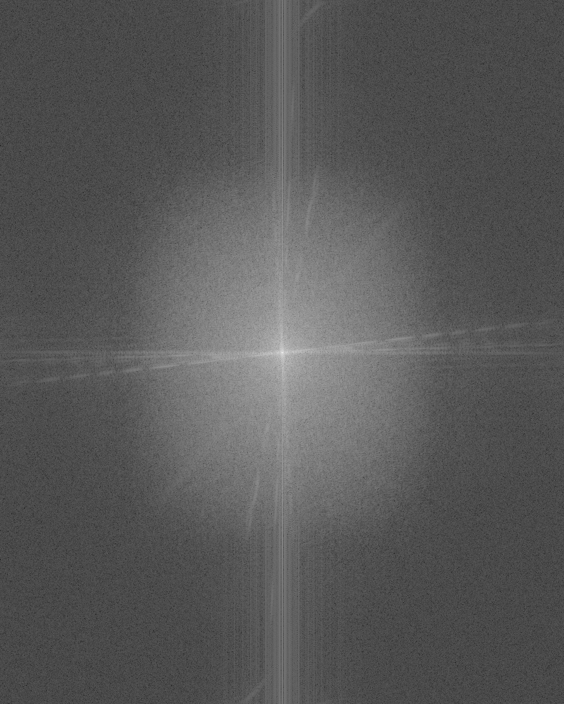

# GPU-Accelerated Batch Image Processing and Analysis

This project is a capstone demonstrating proficiency in CUDA programming by implementing a high-performance, batch image processing pipeline. The program automatically finds all images in an `input_images` folder, applies a series of GPU-accelerated effects, and saves the results to an `output_images` folder.

For each image, the pipeline performs:

- A **Gaussian Blur** using the NVIDIA Performance Primitives (NPP) library.
- A custom **Sepia filter** using a parallel CUDA kernel.
- A **2D Fast Fourier Transform (FFT)** using the cuFFT library to analyze and visualize the image's frequency components.

The entire process is managed with CUDA streams and events to maximize throughput and accurately measure performance.

## ✨ Core Concepts Demonstrated

- **CUDA Kernels**: A custom kernel, `sepia_kernel`, is implemented to apply the sepia filter. Each thread is responsible for one output pixel. It reads the corresponding RGB values from global device memory, performs the sepia calculation (`(r*.393) + (g*.769) + (b*.189)`), clamps the results to the `0-255` range, and writes the new RGB value back to the output device memory. Additional kernels are used to prepare data for the FFT (`convert_to_complex_kernel`) and to convert the FFT's complex output into a viewable image (`visualize_fft_kernel`).

- **Threads, Blocks, and Grids**: Kernel launches are configured using a 2D grid of 2D thread blocks (e.g., 16x16 threads per block). The grid dimensions are calculated based on the image size (`(width + 15) / 16`) to ensure that every pixel is covered by at least one thread. This mapping is a standard, efficient pattern for processing 2D data like images.

- **Host and Device Memory Management**: The project demonstrates a robust memory management strategy for batch processing variable-sized images.

  - **Host**: `stbi_load` reads an image file into a `unsigned char*` buffer on the CPU.
  - **Device**: `cudaMallocPitch` is used to allocate 2D arrays on the GPU. This is crucial as it pads each row to ensure memory alignment, which optimizes memory access patterns for 2D data and improves performance.
  - **Data Transfer**: `cudaMemcpy2DAsync` is used to transfer image data between the host and device. The `Async` variant, combined with a CUDA stream, allows the transfer to happen concurrently with other operations.
  - **Cleanup**: All allocated device memory is explicitly freed with `cudaFree` after each image is processed to prevent memory leaks.

- **NVIDIA Performance Primitives (NPP)**: The Gaussian blur is implemented using the highly optimized `nppiFilterGauss_8u_C3R` function from the NPP library. This avoids the need to write a custom blur kernel and leverages NVIDIA's hand-tuned implementation for maximum performance. The function is configured with the device memory pointers, pitch, image dimensions, and a 5x5 mask size.

- **cuFFT Library**: The 2D Fast Fourier Transform is performed in several steps:

  1.  A `cufftPlan2d` is created to configure the FFT based on the image's dimensions.
  2.  The `uchar3` image data is converted to `cufftComplex` (a `float2` struct) using a custom kernel.
  3.  `cufftExecC2C` executes the complex-to-complex forward FFT on the GPU.
  4.  To create a visual representation, a custom kernel processes the complex output. It calculates the magnitude of each frequency component, applies a log scale to compress the dynamic range, and shifts the zero-frequency component to the center of the image. The result is normalized and saved as a grayscale image.

- **CUDA Streams and Events**: Asynchronous execution is managed to maximize GPU utilization.

  - A single `cudaStream_t` is created and used for all operations within the processing loop for an image (memory copies, kernel launches, library calls). This allows the CUDA runtime to overlap data transfers with kernel execution.
  - `cudaEvent_t` objects are used to accurately time the GPU workload. `cudaEventRecord` places `start` and `stop` markers in the stream before and after the processing calls. `cudaEventElapsedTime` then calculates the precise time elapsed on the GPU between these two events, excluding any CPU overhead.

- **C++17 `<filesystem>`**: The program uses the modern C++ filesystem library for robust and cross-platform file handling. `std::filesystem::directory_iterator` is used to automatically discover all files in the `input_images` directory, and `std::filesystem::path` objects are used to easily parse and construct input and output filenames, making the batch processing logic clean and reliable.

## 🔧 Prerequisites

- NVIDIA GPU with CUDA support
- NVIDIA CUDA Toolkit (includes `nvcc`, NPP, cuFFT, etc.)
- A C++ compiler (like MSVC, which comes with Visual Studio and the "Desktop development with C++" workload)
- `make` utility for Windows (can be installed via Chocolatey: `choco install make`)
- **stb_image library**: This project uses the single-header `stb_image.h` and `stb_image_write.h` libraries. Please download them from the [stb GitHub repository](https://github.com/nothings/stb) and place them in your project directory.

## 🚀 Setup, Build, and Run

### 1. Prepare the Project Structure

Create the folders and place your files as shown below.

```
/CapstoneProject/
|-- /input_images/      <-- Create this folder
|   |-- image1.jpg
|   |-- image2.png
|   |-- ... (add your images here)
|
|-- main.cu
|-- Makefile
|-- stb_image.h
|-- stb_image_write.h
```

### 2. Add Your Images

Place all the images you want to process (e.g., `.jpg`, `.png`, `.bmp`) inside the `input_images` folder.

### 3. Build the Program

Open the Developer Command Prompt for VS, navigate to your project directory, and run the `make` command:

```bash
make
```

This will compile `main.cu` and create the executable `image_processor.exe`.

### 4. Execute the Batch Process

Run the program from the same terminal:

```bash
.\image_processor.exe
```

// ...existing code...

## 📊 Expected Output

The program will automatically:

- Create an `output_images` folder if it doesn't already exist.
- Loop through every valid image in `input_images`.
- For each input image (e.g., `cat.jpg`), it will save three processed files to the `output_images` folder:
  - `cat_blurred.jpg`
  - `cat_sepia.jpg`
  - `cat_fft.jpg`
- Print the processing time for each image to the console.

## 🖼️ Example Results

Below is an example of the pipeline processing `input_images/cat.jpg` and the corresponding results saved in the `output_images` folder.

|          Original (`cat.jpg`)           |        Gaussian Blur (`cat_blurred.jpg`)        |    Sepia Filter (`cat_sepia.jpg`)     |   FFT Magnitude (`cat_fft.jpg`)   |
| :-------------------------------------: | :---------------------------------------------: | :-----------------------------------: | :-------------------------------: |
|  |  |  |  |
